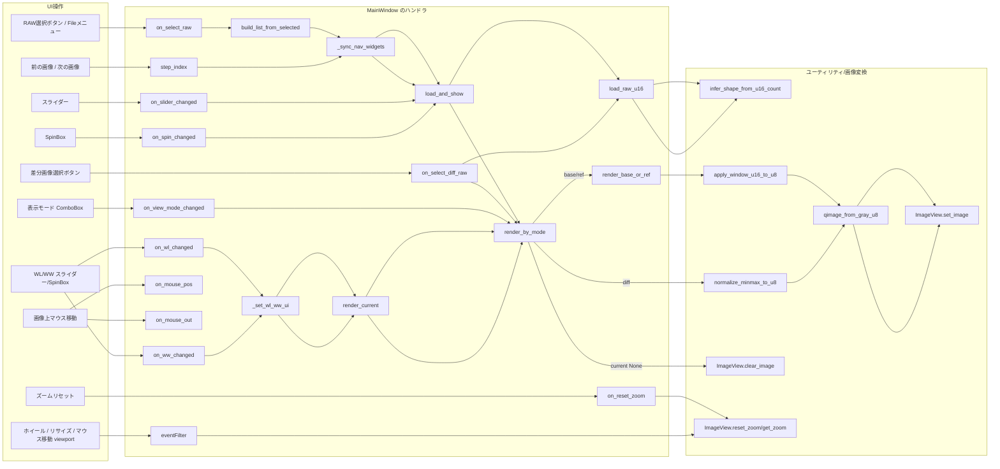
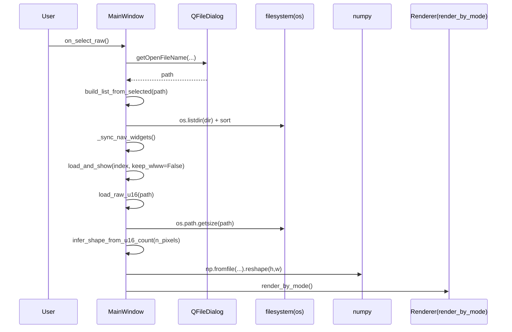

## 1) 全体：イベント駆動の呼び出し関係（主要フロー）


```mermaid
flowchart LR
  subgraph UI[UI操作]
    A[RAW選択ボタン / Fileメニュー] 
    B[差分画像選択ボタン]
    C[前の画像 / 次の画像]
    D[スライダー]
    E[SpinBox]
    F[WL/WW スライダー/SpinBox]
    G[表示モード ComboBox]
    H[ズームリセット]
    I[画像上マウス移動]
    J[ホイール / リサイズ / マウス移動 viewport]
  end
  
  subgraph MW[MainWindow のハンドラ]
    onSelectRaw[on_select_raw]
    buildList[build_list_from_selected]
    syncNav[_sync_nav_widgets]
    loadShow[load_and_show]
    loadRaw[load_raw_u16]
    renderMode[render_by_mode]
    renderBR[render_base_or_ref]

    onSelectDiff[on_select_diff_raw]
    onViewMode[on_view_mode_changed]

    stepIdx[step_index]
    onSlider[on_slider_changed]
    onSpin[on_spin_changed]

    onWL[on_wl_changed]
    onWW[on_ww_changed]
    setWLWW[_set_wl_ww_ui]
    renderCur[render_current]

    onResetZoom[on_reset_zoom]

    onMousePos[on_mouse_pos]
    onMouseOut[on_mouse_out]

    evtFilter[eventFilter]
  end
  
  subgraph Util[ユーティリティ/画像変換]
    infer[infer_shape_from_u16_count]
    wlwwMap[apply_window_u16_to_u8]
    minmax[normalize_minmax_to_u8]
    qimg[qimage_from_gray_u8]
    viewSet[ImageView.set_image]
    viewClear[ImageView.clear_image]
    viewZoom[ImageView.reset_zoom/get_zoom]
  end

  %% --- wiring (signals) ---
  A --> onSelectRaw
  B --> onSelectDiff
  C --> stepIdx
  D --> onSlider
  E --> onSpin
  F --> onWL
  F --> onWW
  G --> onViewMode
  H --> onResetZoom
  I --> onMousePos
  I --> onMouseOut
  J --> evtFilter

  %% --- main flows ---
  onSelectRaw --> buildList --> syncNav --> loadShow
  stepIdx --> syncNav --> loadShow
  onSlider --> loadShow
  onSpin --> loadShow

  loadShow --> loadRaw --> infer
  loadShow --> renderMode
  onSelectDiff --> loadRaw --> infer
  onSelectDiff --> renderMode

  onViewMode --> renderMode

  onWL --> setWLWW --> renderCur --> renderMode
  onWW --> setWLWW --> renderCur --> renderMode

  renderMode -->|base/ref| renderBR --> wlwwMap --> qimg --> viewSet
  renderMode -->|diff| minmax --> qimg --> viewSet
  renderMode -->|current None| viewClear

  onResetZoom --> viewZoom

  evtFilter --> viewZoom

```

## A. 「RAW選択…」を押す（または File メニュー）


```mermaid
sequenceDiagram
  participant U as User
  participant MW as MainWindow
  participant FD as QFileDialog
  participant FS as filesystem(os)
  participant NP as numpy
  participant R as Renderer(render_by_mode)

  U->>MW: on_select_raw()
  MW->>FD: getOpenFileName(...)
  FD-->>MW: path
  MW->>MW: build_list_from_selected(path)
  MW->>FS: os.listdir(dir) + sort
  MW->>MW: _sync_nav_widgets()
  MW->>MW: load_and_show(index, keep_wlww=False)
  MW->>MW: load_raw_u16(path)
  MW->>FS: os.path.getsize(path)
  MW->>MW: infer_shape_from_u16_count(n_pixels)
  MW->>NP: np.fromfile(...).reshape(h,w)
  MW->>R: render_by_mode()

```

```mermaid
```
